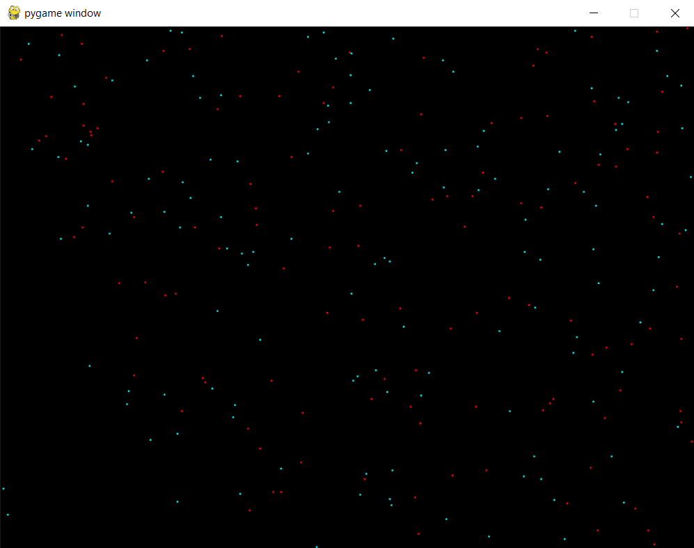

# Particle System

## Intro

Simple particle system for games using Pygame.

---

## Controls

q - add standard particle 1

w - add standard particle 2

e - add small bounce particle

r - add large bounce particle

right mouse - move bounce particles towards mouse position

a - explode all particles

---

## Method summary